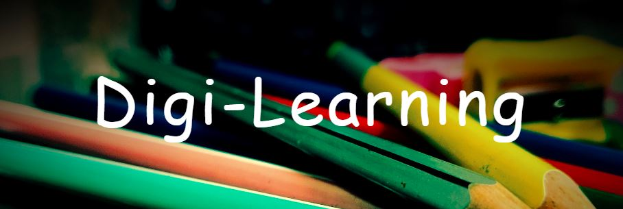

### Hi, Welcome to the `ARJ-Stack` techspace!! 👋

#### Who we are? 
---
We are a non profit entity, endeavour to leverage on the latest technologies to deliver the learning material through digital resources. We strive to keep repositories in this account more organized and documented so that you can read it easily, and accurately progress your learning through the solutions we are designing. 

#### Core Values
---
We are more formalized and always thrive to align ourself with our core values to achieve high success and to follow the standards. The standards, the core values that we follows are <b>PASSION</b>, <b>INTEGRITY</b> and <b>INNOVATION</b>

##### PASSION
We have a strong feeling of intense enthusiasm towards our vision and to design the high quality, easy to understand learning material

##### INTEGRITY
We are a integrated team working towards making this platform widely accessible to useful to wide varity of students. By integrity we don't only mean the completeness within the team but also a team with high morality and ethics

##### INNOVATION
We always look for positive ideas and pathways that we can use to deliver the educational contents in better and efficient way.

#### Digi Learning Platform | [arjstack](https://www.arjstack.com/)
---

We are a non profit entity, endeavour to leverage on the latest technologies to deliver the learning material through digital resources. We are more formalized and provide you with the features and support one need to execute the e-learning strategy perfectly. We have a nice team backed by a superb customer success team whose sole objective is to ensure you succeed.

We strive to make this platform more organized so that you can enroll easily, and accurately progress your learning. You can cover the mateiral when you have time, go over it as often as you need, all without going over to the classroom with a greater control over the time spent on the course.

 - Proper content object model
 - Your schedule, Your pace, Your place
 - Develop a can-do attitude
 - Engaging experience
 - Lots of fun activities and technical videos
